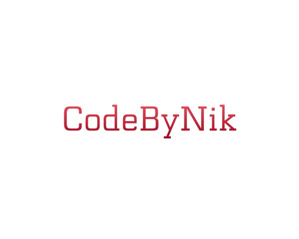

# 📈 StockLens Hub - Modern Stock Market Analysis Dashboard

<div align="center">
  
  
  [](https://python.org)
  [](https://dash.plotly.com)
  [](LICENSE)
  [](https://www.codebynik.live)
</div>

## 🚀 Overview

StockLens Hub is a comprehensive, mobile-responsive web application that democratizes stock market analysis. Built with Python and Dash, it provides real-time technical analysis, ML-powered price predictions, and educational content for both beginners and experienced traders.

## ✨ Key Features

### 📊 **Smart Analysis**
- **Intelligent Ticker Input**: Enter Indian stocks without ".NS" suffix (e.g., just "TCS" instead of "TCS.NS")
- **Advanced Technical Indicators**: RSI, MACD, Bollinger Bands, EMA, Stochastic Oscillator, ATR
- **Buy/Sell Signals**: Automated signal generation based on EMA crossovers

### 🤖 **AI-Powered Predictions**
- **Machine Learning Models**: Neural network-based price prediction
- **Error Metrics**: RMSE and MAE for prediction accuracy validation
- **Future Price Forecasting**: 30-day price predictions with confidence metrics

### 📱 **User Experience**
- **Mobile-First Design**: Fully responsive interface optimized for all devices
- **Modern UI**: Clean, intuitive design with custom CSS styling
- **Educational Content**: Built-in explanations for all technical indicators

### 📈 **Comprehensive Analysis**
- **Market Sentiment**: AI-powered sentiment scoring with clear verdicts
- **Financial Statements**: Complete income statements, balance sheets, cash flow
- **Peer Comparison**: Side-by-side analysis of multiple stocks
- **Interactive Charts**: Plotly-powered visualizations with zoom and pan

### 🛡️ **Safety & Compliance**
- **Disclaimer Modal**: Mandatory agreement before dashboard access
- **Educational Focus**: Clear emphasis on learning over investment advice
- **SEBI Compliance**: Appropriate disclaimers for Indian market regulations

## 🛠️ Tech Stack

- **Backend**: Python 3.8+
- **Web Framework**: Dash (Plotly)
- **Data Source**: Yahoo Finance API (yfinance)
- **ML/AI**: Neural Networks, scikit-learn
- **Data Processing**: Pandas, NumPy
- **Visualization**: Plotly
- **Styling**: Custom CSS with responsive design

## 📋 Prerequisites

- Python 3.8 or higher
- pip (Python package installer)
- Internet connection (for real-time data fetching)

## 🚀 Quick Start

### 1. Clone the Repository
```bash
git clone https://github.com/yourusername/stocklens-hub.git
cd stocklens-hub
```

### 2. Install Dependencies
```bash
pip install -r requirements.txt
```

### 3. Run the Application
```bash
python fetch.py
```

### 4. Access the Dashboard
Open your web browser and navigate to:
```
http://127.0.0.1:8050
```

## 📦 Installation (Detailed)

### Option 1: Using pip
```bash
# Clone the repository
git clone https://github.com/yourusername/stocklens-hub.git
cd stocklens-hub

# Install required packages
pip install -r requirements.txt

# Run the application
python fetch.py
```

### Option 2: Using Virtual Environment (Recommended)
```bash
# Clone the repository
git clone https://github.com/yourusername/stocklens-hub.git
cd stocklens-hub

# Create virtual environment
python -m venv stocklens_env

# Activate virtual environment
# On Windows:
stocklens_env\Scripts\activate
# On macOS/Linux:
source stocklens_env/bin/activate

# Install dependencies
pip install -r requirements.txt

# Run the application
python fetch.py
```

### Option 3: Using Conda
```bash
# Clone the repository
git clone https://github.com/yourusername/stocklens-hub.git
cd stocklens-hub

# Create conda environment
conda create -n stocklens python=3.8
conda activate stocklens

# Install dependencies
pip install -r requirements.txt

# Run the application
python fetch.py
```

## 📖 Usage Guide

### Basic Usage
1. **Launch the Application**: Run `python fetch.py`
2. **Accept Disclaimer**: Click "I Agree" on the disclaimer modal
3. **Enter Stock Symbol**: Type any stock symbol (e.g., "AAPL", "TCS", "RELIANCE")
4. **Select Date Range**: Choose custom dates or use default (last 5 years)
5. **Explore Tabs**: Navigate through Analysis, Fundamentals, Financials, and Market Sentiment

### Advanced Features
- **Peer Comparison**: Enter multiple tickers separated by commas (e.g., "TCS,INFY,WIPRO")
- **Custom Date Ranges**: Use date pickers for specific analysis periods
- **Mobile Access**: Access the dashboard on mobile devices for on-the-go analysis

### Supported Markets
- **Indian Stocks**: NSE (automatically adds .NS suffix)
- **US Stocks**: NASDAQ, NYSE
- **Global Markets**: Most Yahoo Finance supported symbols

## 🔧 Configuration

### Customizing the Application
- **Port Configuration**: Modify the port in `fetch.py` (default: 8050)
- **Data Sources**: Currently uses Yahoo Finance; can be extended to other APIs
- **Styling**: Customize CSS in the `app.index_string` section

### Performance Optimization
- **Caching**: Implement data caching for faster repeated queries
- **Async Processing**: Add background data processing for large datasets

## 📊 Technical Indicators Explained

| Indicator | Purpose | Interpretation |
|-----------|---------|----------------|
| **RSI** | Momentum oscillator | >70: Overbought, <30: Oversold |
| **MACD** | Trend following | MACD > Signal: Bullish |
| **Bollinger Bands** | Volatility | Price near bands indicates potential reversal |
| **EMA** | Trend direction | EMA20 > EMA50: Uptrend |
| **Stochastic** | Momentum | >80: Overbought, <20: Oversold |
| **ATR** | Volatility measure | Higher values indicate higher volatility |

## 🤝 Contributing

We welcome contributions! Please follow these steps:

1. **Fork the Repository**
2. **Create Feature Branch**: `git checkout -b feature/amazing-feature`
3. **Commit Changes**: `git commit -m 'Add amazing feature'`
4. **Push to Branch**: `git push origin feature/amazing-feature`
5. **Open Pull Request**

### Development Guidelines
- Follow PEP 8 coding standards
- Add docstrings to all functions
- Include error handling for API calls
- Test on multiple screen sizes
- Maintain responsive design principles

## 🐛 Troubleshooting

### Common Issues

**1. Import Errors**
```bash
# Solution: Install missing packages
pip install -r requirements.txt
```

**2. Data Fetching Errors**
```bash
# Check internet connection and ticker symbol validity
# Some symbols may require specific suffixes (.NS for NSE, .BO for BSE)
```

**3. Port Already in Use**
```bash
# Change port in fetch.py or kill existing process
# Windows: netstat -ano | findstr :8050
# macOS/Linux: lsof -ti:8050
```

**4. Mobile Display Issues**
```bash
# Clear browser cache and ensure latest version
# Check viewport meta tag is present
```

## 📜 License

This project is licensed under the MIT License - see the [LICENSE](LICENSE) file for details.

## ⚠️ Disclaimer

**Important**: This tool is for educational and informational purposes only. It does not constitute investment advice, recommendation, or solicitation to buy or sell any securities. The creators are not SEBI-registered investment advisors. Users are solely responsible for their investment decisions and should consult qualified financial advisors. Past performance is not indicative of future results. All investments carry risk of loss.

## 🙏 Acknowledgments

- **Yahoo Finance**: For providing free financial data API
- **Plotly/Dash**: For the excellent web framework
- **Python Community**: For the amazing ecosystem of libraries
- **Open Source Contributors**: For inspiration and code references

## 📞 Contact & Support

- **Website**: [www.codebynik.live](https://www.codebynik.live)
- **Feedback**: [Submit Feedback Form](https://forms.gle/kdLnidUgrumkz9uS6)
- **Issues**: [GitHub Issues](https://github.com/yourusername/stocklens-hub/issues)

---

<div align="center">
  <p><strong>Made with ❤️ by Nikunj Maru</strong></p>
  <p>⭐ Star this repo if you find it helpful!</p>
</div>
